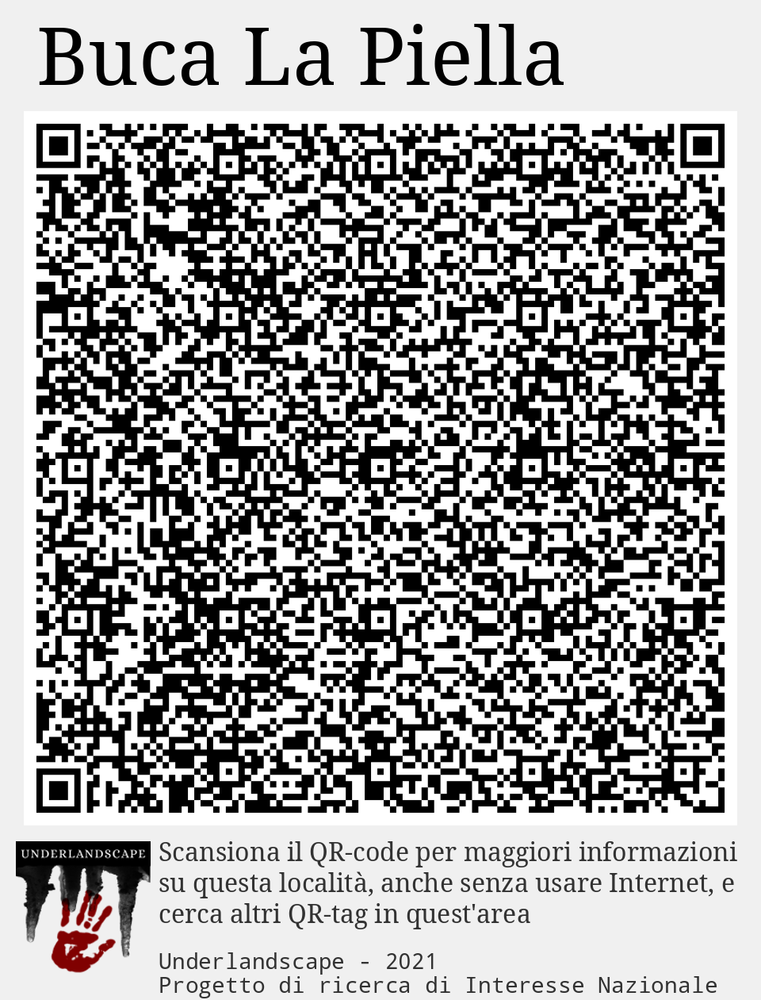
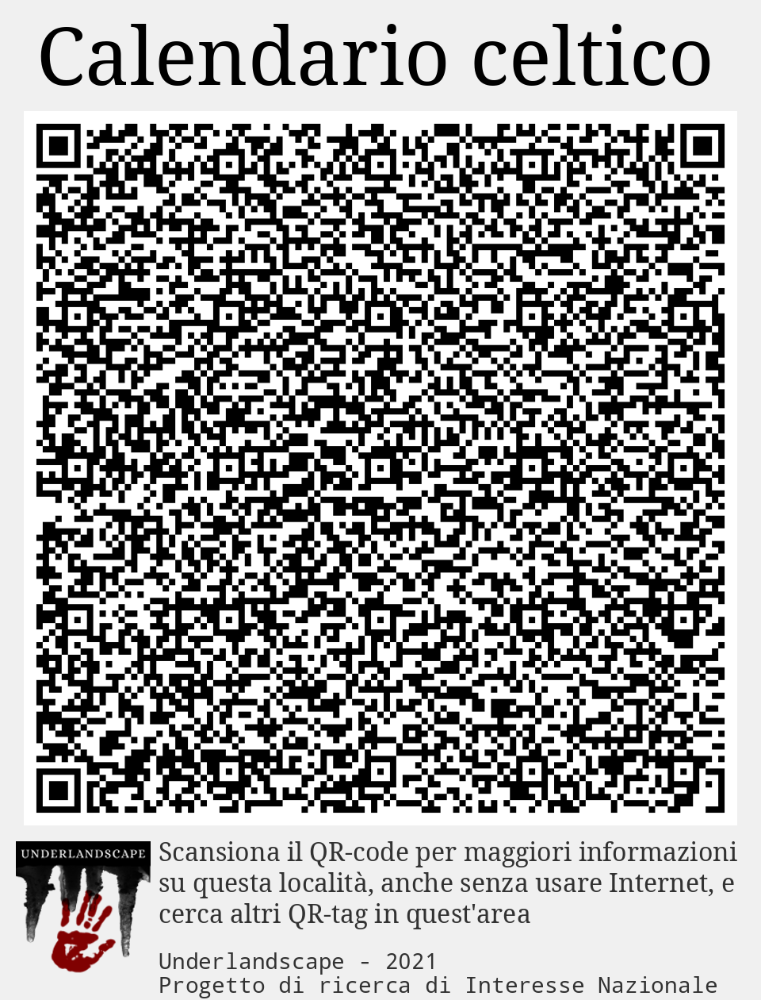
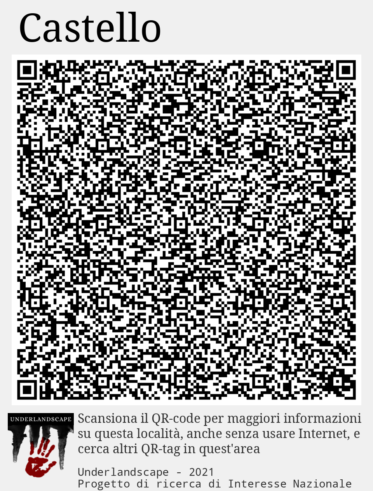
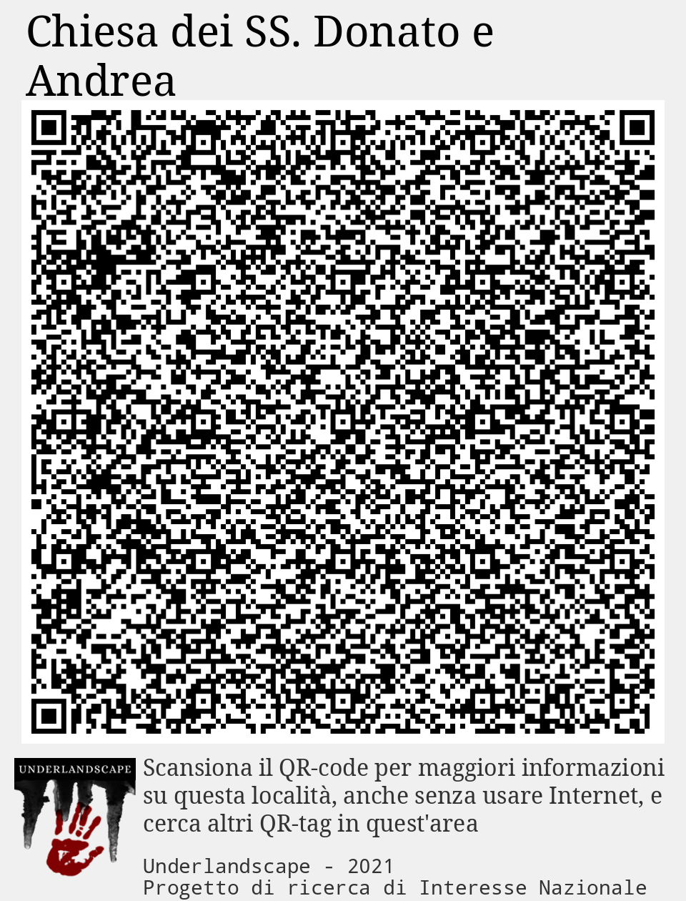
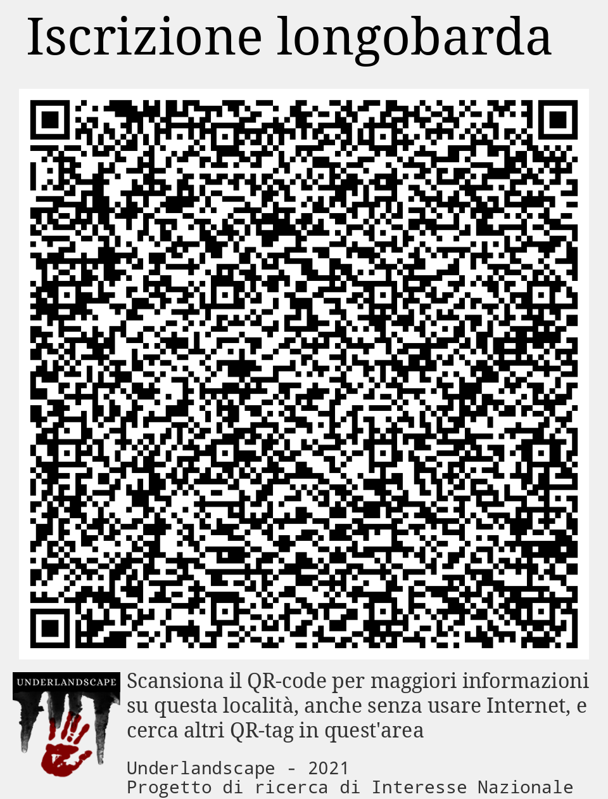
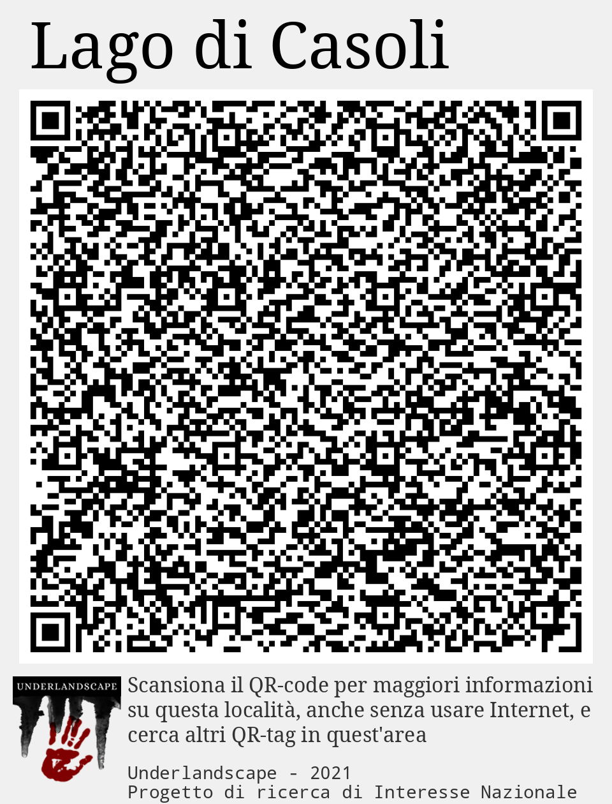
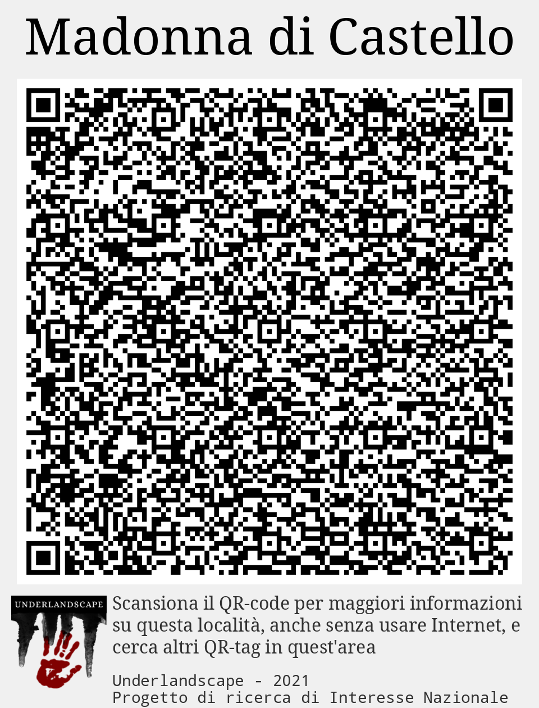
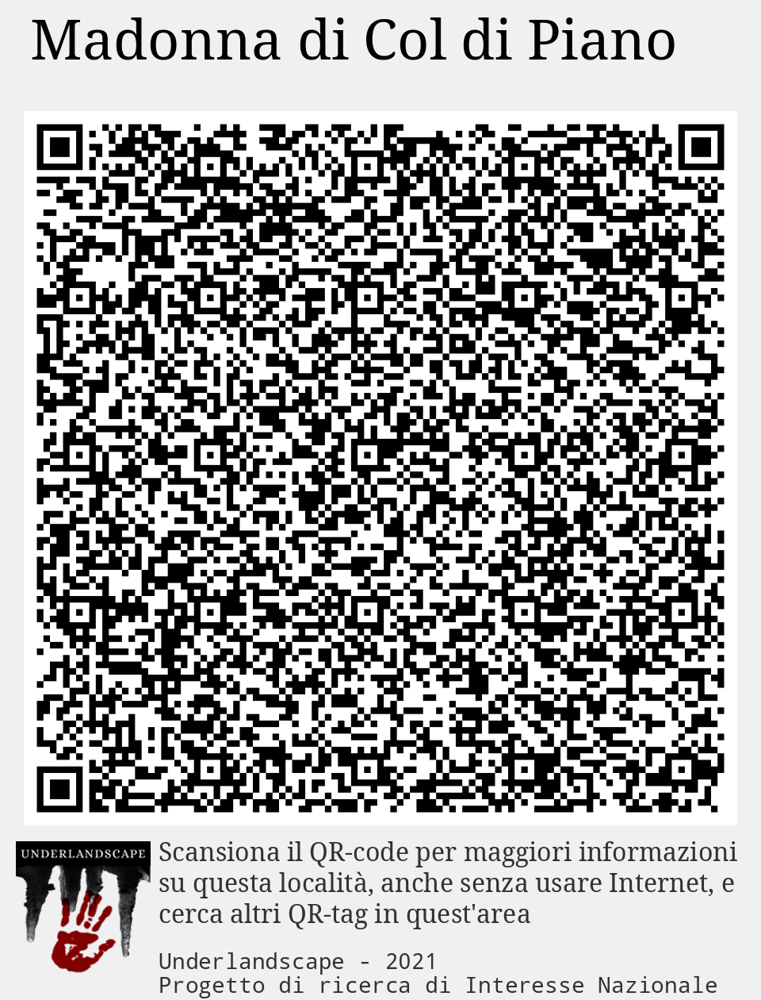
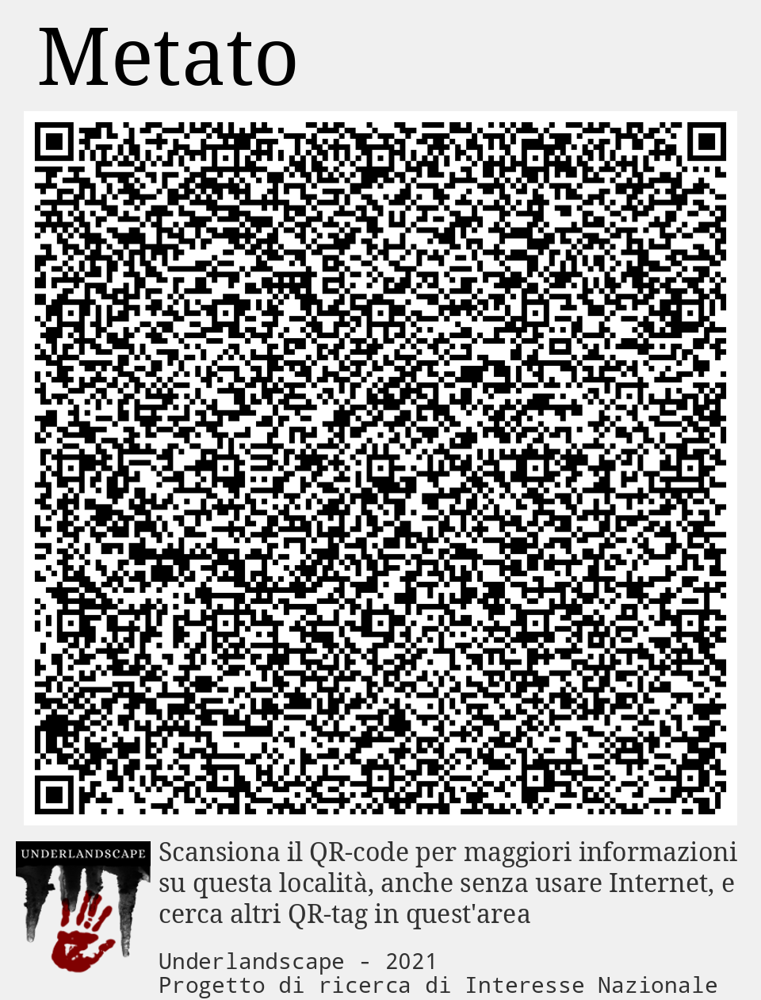

# QRT000_Casoli ([mappa](https://umap.openstreetmap.fr/it/map/qrt000_casoli_1041683))
Dataset contenente i QRtag segnaletici collocati nell'area di Casoli durante la prima ricognizione
## QRtag: Buca La Piella
 *Nessuna immagine* 

**Accesso Buca "La Piella**
## QRtag: Calendario celtico
 *Nessuna immagine* 

****
## QRtag: Castello
 *Nessuna immagine* 

****
## QRtag: Chiesa dei SS. Donato e Andrea
 *Nessuna immagine* 

****
## QRtag: Iscrizione longobarda
 *Nessuna immagine* 

****
## QRtag: Lago di Casoli
 *Nessuna immagine* 

****
## QRtag: Madonna di Castello
 *Nessuna immagine* 

****
## QRtag: Madonna di Col di Piano
 *Nessuna immagine* 

****
## QRtag: Metato
 *Nessuna immagine* 

****
## QRtag: Sant'Andrea de Lacu
 *Nessuna immagine* 

****
