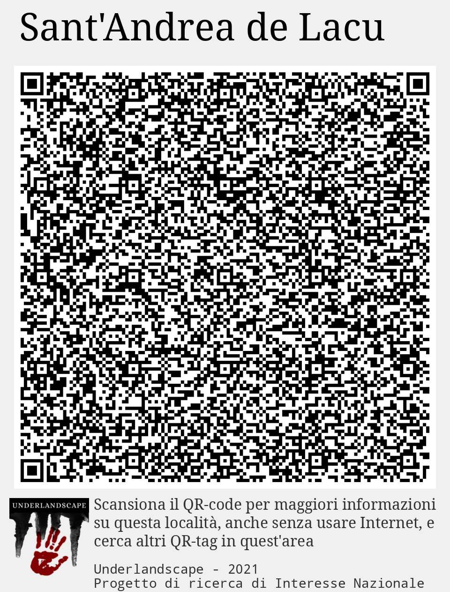

# QRT000_Casoli ([mappa](https://umap.openstreetmap.fr/it/map/qrt000_casoli_1041683))
Dataset contenente i QRtag segnaletici collocati nell'area di Casoli durante la prima ricognizione

Questo dataset fa parte dei risultati del progetto [PRIN Underlandscape](https://sites.google.com/view/prin-underlandscape/)

La mappa di sommario con tutti i dataset prodotti nel corso del progetto è disponibile a questo [link](https://umap.openstreetmap.fr/it/map/sommario_1044830)

## QRtag: Buca La Piella
Accesso Buca "La Piella

 *Nessuna immagine* 

**Accesso Buca "La Piella**
## QRtag: Calendario celtico
Descrizione di Calendario celtico (QRtag) mancante
 *Nessuna immagine* 

****
## QRtag: Castello
Descrizione di Castello (QRtag) mancante
 *Nessuna immagine* 

****
## QRtag: Chiesa dei SS. Donato e Andrea
Descrizione di Chiesa dei SS. Donato e Andrea (QRtag) mancante
 *Nessuna immagine* 

****
## QRtag: Iscrizione longobarda
Descrizione di Iscrizione longobarda (QRtag) mancante
 *Nessuna immagine* 

****
## QRtag: Lago di Casoli
Descrizione di Lago di Casoli (QRtag) mancante
 *Nessuna immagine* 

****
## QRtag: Madonna di Castello
Descrizione di Madonna di Castello (QRtag) mancante
 *Nessuna immagine* 

****
## QRtag: Madonna di Col di Piano
Descrizione di Madonna di Col di Piano (QRtag) mancante
 *Nessuna immagine* 

****
## QRtag: Metato
Descrizione di Metato (QRtag) mancante
 *Nessuna immagine* 

****
## QRtag: Sant'Andrea de Lacu
Descrizione di Sant'Andrea de Lacu (QRtag) mancante
 *Nessuna immagine* 

****
